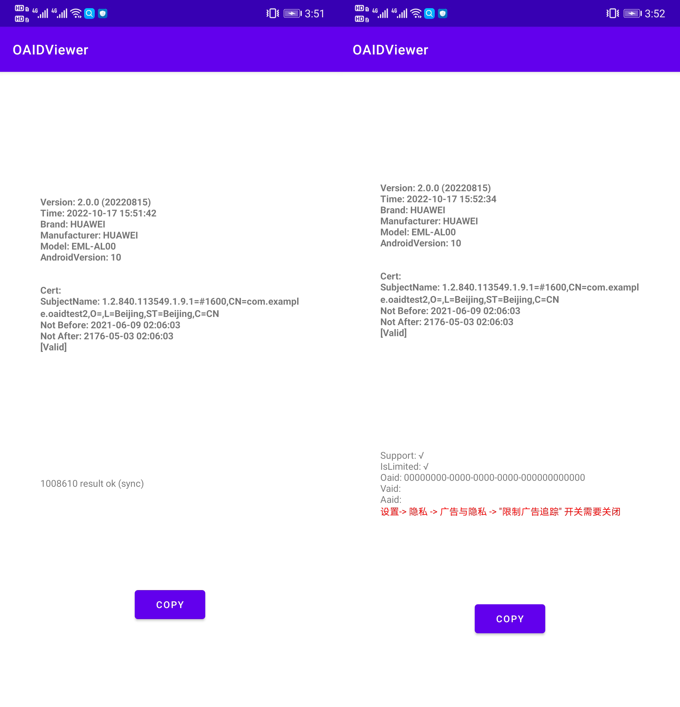

# OAID 查看器

接入 OAID SDK 的 Demo 工程

***

- [官方Demo](./Doc/2.0.0/oaid_sdk_demo_release_20220901.apk) 官方 2.0.0 版本 demo-apk 下载

- [release](../..//releases) 提供 APK 下载

- 支持设备见 [移动智能终端补充设备标识体系统一调用SDK开发者说明文档](./Doc/2.0.0/移动智能终端补充设备标识体系统一调用SDK开发者说明文档v2.0.0.pdf)

- 常见问题见 [移动智能终端补充设备标识体系统一调用SDK F&Q](./Doc/2.0.0/移动智能终端补充设备标识体系统一调用SDK%20F&Qv3.0.pdf)

- 标识规范见 [团体标准-移动智能终端补充设备标识规范](./Doc/1.1.0/团体标准-移动智能终端补充设备标识规范-v20190516.pdf)

- 增加了 IMEI 获取与权限申请

***

## 效果图

---

## 感谢

- [2tu/msa](https://github.com/2tu/msa)